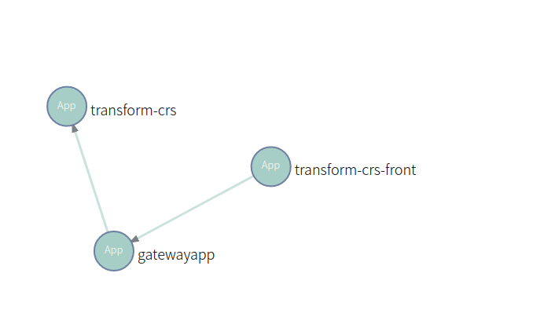
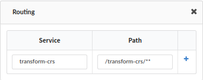
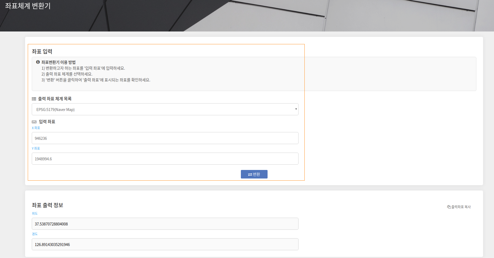
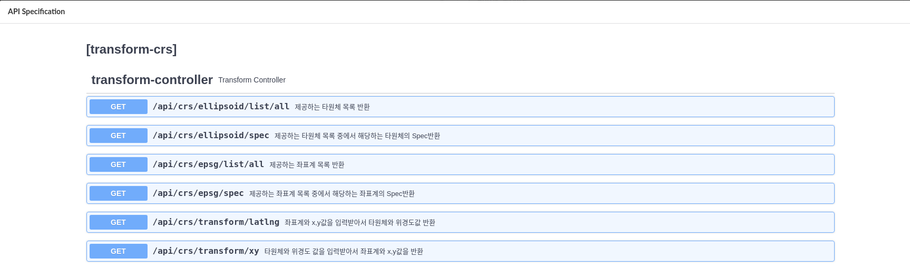

## **목차**

  ### [**1. MavenBuild**](https://github.com/startupcloudplatform/transform-crs/blob/master/README.md#maven-build)

  ### [**2. manifest.yml 작성**](https://github.com/startupcloudplatform/transform-crs/blob/master/README.md#manifestyml-%EC%9E%91%EC%84%B1)

  ### [**3. cf push**](https://github.com/startupcloudplatform/transform-crs/blob/master/README.md#cf-push)

### [4. 마이크로서비스 구성 방법]()

  ### [**5. 최종 결과 화면**](https://github.com/startupcloudplatform/transform-crs/blob/master/README.md#%EC%B5%9C%EC%A2%85-%EA%B2%B0%EA%B3%BC%ED%99%94%EB%A9%B4)

   

------


#### **Maven Build**

각 프로젝트 폴더로 이동하여 maven 빌드를 통해 jar파일 생성

```
mvn clean package
```


#### Manifest.yml 작성

````
---
applications:
  - name: (cf에 push되는 앱 이름)
    memory: 1G
    path: (jar파일이 있는 경로)/(jar파일).jar
    buildpack: java_buildpack
    env:
      msa: yes
      private: (paasta 계정 id)
      
ex)   
---
applications:
  - name: transform-crs-front
    memory: 1G
    path: target/trsfrm-crs-front-0.0.1-SNAPSHOT.jar
    buildpack: java_buildpack
    env:
      msa: yes
      private: test
````


#### CF Push

사용할 조직과 스페이스를 생성하고, 타겟을 설정한다. 

 준비해둔 manifest.yml 파일과 jar 파일을 이용하여 cf 상에 앱을 push 한다
 앱 push 후에 [MicroStudio](http://203.245.1.101:8080/login)를 이용하여 마이크로서비스 구성

````
# cf 조직 생성
cf create-org (생성할조직 이름)
ex) cf create-org sample-org

# cf 스페이스 생성
cf create-space (생성할 스페이스 이름) -o (생성된 조직 이름)
ex) cf create-space sample-space -o sample-org

# cf target 설정
cf target -o (조직이름) -s (스페이스이름)
ex) cf target -o sample-org -s sample-space

# cf에 application 배포
ex) cf push
````


#### 마이크로서비스 구성방법

######  - 서비스간 연결 구조



######   - 라우팅 설정 

​     transform-crs 어플리케이션의 name 변경시 다른 값으로  변경될 수 있음.

​     ( transform-crs 프로젝트의 bootstrap.properties 참고 )



#### **최종 결과화면**

2차원 좌표 입력 후 변환하면 위경도(3차원)좌표를 확인할 수 있습니다.



사용가능한 API 목록


